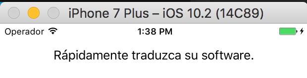

Globalization Pipeline Client SDK for iOS
===============

What is this?
--------------
This is a iOS framework and sample code for the 
[Globalization Pipeline](https://github.com/IBM-Bluemix/gp-common#globalization-pipeline)
Bluemix service. The IBM Globalization Pipeline makes it easy for you to provide your global customers with Bluemix applications translated into the languages in which they work.

Adding this framework into your Swift or Obj-C project, your application can dynamically request translations of your application content from the IBM Globalization Pipeline.

Note that this framework implements HTTP Basic authentication, which means that a “reader” credential must be used.
Other credential classes will be rejected by the server.

## Getting started

### Set up the Globalization Pipeline service

To get started, you should familiarize yourself with the service itself. A good place
to begin is by reading the [Quick Start Guide](https://github.com/IBM-Bluemix/gp-common#quick-start-guide) and the official [Getting Started with IBM Globalization ](https://www.ng.bluemix.net/docs/services/GlobalizationPipeline/index.html)
documentation.

The documentation explains how to find the service on Bluemix, create a new service
instance, create a new bundle, and access the translated messages.

### Use the included test

1. create a Globalization Pipeline instance using the [Quick Start Guide](https://github.com/IBM-Bluemix/gp-common#quick-start-guide)
documentation.

2. Create a bundle named `uistrings` and upload the file [uistrings_en.json](./TestFramework/TestSDK/TestSDK/uistrings_en.json)
as the English source content. Choose the target language(s) you wish to translate to.

3. Create a new Reader user with access to the `uistrings` bundle.  Save the url, userId, password, and instanceId parameters

4. Copy the [ReaderCredentials-SAMPLE.swift](./TestFramework/TestSDK/TestSDK/ReaderCredentials-SAMPLE.swift) source file to `ReaderCredentials.swift` (in the same directory)

5. Modify the [TestFramework/TestSDK/TestSDK/ReaderCredentials.swift](./TestFramework/TestSDK/TestSDK/ReaderCredentials-SAMPLE.swift) source file to include these credentials.

6. Now, you should be able to build and run the application from XCode. The translated language (from the Settings) will
be used for display.



## Using with your own project

### Manual

1. Clone or download the SDK repository locally
2. Drag the [GPSDK/GPSDK.xcodeproj](GPSDK/GPSDK.xcodeproj) file into your own XCode workspace
3. Change the Scheme to _GPSDK_ and build it in your own XCode workspace
4. Change the Scheme back to your application's Scheme. Verify that build works.

### Carthage

1. Install [Carthage](https://github.com/Carthage/Carthage)
2. add/create a [`Cartfile`](https://github.com/Carthage/Carthage/blob/master/Documentation/Artifacts.md#cartfile) containing the following (replace `master` with a [version number](https://github.com/IBM-Bluemix/gp-ios-client/releases) if desired)

```
     github "IBM-Bluemix/gp-ios-client" "master"
```

3. Run `carthage update`
4. You should now be able to add `Carthage/Build/iOS/GPSDK.framework` to your own project’s linked frameworks.
5. See the [Carthage documentation](https://github.com/Carthage/Carthage#adding-frameworks-to-an-application) for more detail. In particular, you will need to add or update a `copy-frameworks` step with the following input file:

```
     $(SRCROOT)/Carthage/Build/iOS/GPSDK.framework
```


## Sample Code

Note: the first four parameters to `initService()` are your Globalization Pipeline
reader credentials, see the [Quick Start Guide](https://github.com/IBM-Bluemix/gp-common#quick-start-guide)

```Swift
let service = GPService()
        
do {
	try service.initService(
			url:          "(Your URL)", 
			userId:       "(your userId)", 
			password:     "(your password)", 
			instanceId:   "(your instance ID)", 

			bundleId: "uistrings", 
			languageId:nil, 
			alwaysLoadFromServer: false, 
			expireAfter: 0)
} catch GPService.GPError.languageNotSupported {
        print("This language is not supported...")
} catch GPService.GPError.requestServerError(let errorDescription) {
        print("Request server error: " + errorDescription)
} catch GPService.GPError.HTTPError(let statusCode) {
        print("Request server error: HTTP \(statusCode)")
} catch {
}

label1.text = service.localizedString("Key1", nil)

label2.text = service.localizedString("Key2", "Hello world")
```

## API reference 

   
* GPService

	* initService
		* ######Declaration 
`func initService(url:String!, instanceId:String!, bundleId: String!, userId:String!, password:String!, languageId:String?, alwaysLoadFromServer:Bool!, expireAfter:Int!) throws`

		* ######Descrption 
`Initialize the arguments information and load the useful information in the initial stage. If the information from the server has been loaded successfully, no exception will be thrown. Else, the function will throw corresponding exceptions to the outer function. About the errors, please refer to GPService.GPError.`

		* ######Parameters
		
			* `languageId: This parameter can be set as nil. If it set as nil, system default language will be used.`
			* `alwaysLoadFromServer: If this parameter is set as true, always load result from GP server. Else, if the translation result has been cached, it will load the result from the cache. If no cache has been hit, it will load the translation result from GP server if the cache is not expired.	`
			* `expireAffer: Calculated by hours. This argument will be used to judge if the cache is expired. If the cache is existed more than assigned expired time, it will request the result directly from the GP server.`


	* localizedString
		* ######Declaration 
`func localizedString(_ key:String, _ comment:String?) -> String`

		* ######Descrption 
`Load the value of the corresponding key in the bundle.`

		* ######Parameters
			* `key: The key of your bundle.`
			* `comment: Comment for the key.`

	* localizations
		* ######Declaration 
`func localizations(_ bundleId:String) throws -> [String]?`

		* ######Descrption 
`Get GP supported translation languages for each bundle.`


## Community

* View or file GitHub [Issues](https://github.com/IBM-Bluemix/gp-ios-client/issues)
* Connect with the open source community on [developerWorks Open](https://developer.ibm.com/open/ibm-bluemix-globalization-pipeline/)

## Contributing

See [CONTRIBUTING.md](CONTRIBUTING.md).

## License

Apache 2.0. See [LICENSE.txt](LICENSE.txt).

> Licensed under the Apache License, Version 2.0 (the "License");
> you may not use this file except in compliance with the License.
> You may obtain a copy of the License at
>
> http://www.apache.org/licenses/LICENSE-2.0
>
> Unless required by applicable law or agreed to in writing, software
> distributed under the License is distributed on an "AS IS" BASIS,
> WITHOUT WARRANTIES OR CONDITIONS OF ANY KIND, either express or implied.
> See the License for the specific language governing permissions and
> limitations under the License.
